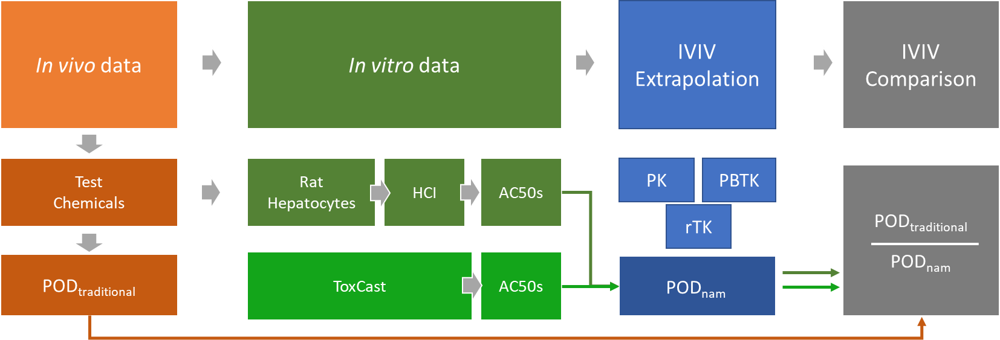

heprn-hci-nam
==============================

This repository contains the necessary data, python source code and jupyter notebooks to reproduce the results from our manuscript, "Estimating Hepatotoxic Doses Using High-content Imaging in Primary Hepatocytes." Using *in vitro* data to estimate point of departure (POD) values is an important component of new approach method (NAM)-based chemical risk assessments. In this case study we evaluated a NAM for hepatotoxicity based on rat primary hepatocytes, high-content imaging (HCI) and *in vitro* to *in vivo* extrapolation (IVIVE). 

# Workflow 

# Project Organization

    ├── README.md                                               # This file
    ├── LICENSE                                                 # License file
    ├── Makefile                                                # Makefile to automate most steps
    ├── environment                                             # Python an R environment setup 
    │   ├── condaenv.yml
    │   ├── rdeps.csv
    │   └── requirements.txt
    ├── inputs                                                  # Input data for the analysis
    │   ├── cyprotex-heprn2-jul-2017-raw-v2.csv                 # Raw well level HCI data 
    │   ├── heprn-chems-1.tsv                                   # Chemical information
    │   ├── heprn-toxcast-hits-qual.csv                         # ToxCast in vitro assay data
    │   └── toxref-v2.0-pods-rat-liver.xlsx                     # ToxRefDB in vivo effect data
    ├── notebooks                                               # Jupyter notebooks for the workflow
    │   └── heprn-ivive                                         # This paper
    │       ├── 010-heprn-db.ipynb                              # Build the database
    │       ├── 012-heprn-chm.ipynb                             # Load chemical information
    │       ├── 015-heprn-raw.ipynb                             # Load the raw HCI data
    │       ├── 050-heprn-qc.ipynb                              # Run HCI QC
    │       ├── 100-heprn-fc.ipynb                              # Analyze HCI effects
    │       ├── 110-heprn-cr.ipynb                              # Analyze concentration response
    │       ├── 130-heprn-cr-manual-qc.ipynb                    # Interactive manual QC 
    │       ├── 152-invitro-potency.ipynb                       # Summarise all in vitro bioactivity data
    │       ├── 205-qivive-rtk.ipynb                            # PBTK simulation for all chemicals
    │       ├── 223-heprn-qivive-aed-cmp.ipynb                  # IVIVE using rTK
    │       └── 301-heprn-qivive-figs.ipynb                     # Generate all figures, tables, suppl. mat.
    ├── outputs                                                 # All output files
    │   ├── figs
    │   └── suppl
    ├── setup.py
    ├── src                                                     # All python packages to support workflow
    │   └── heprnhci 
    │       ├── cr                                              # concentration-response analysis
    │       ├── db                                              # MongoDB database creation
    │       ├── hci                                             # hci processing
    │       ├── tk                                              # toxicokinetic modeling
    │       ├── utl                                             
    │       └── viz                                             # visualisation 
    └── test_environment.py

# How to reproduce the analysis

## Create the Python and R environemt

### Miniconda installation

[Install miniconda3 by following these instructions](https://docs.conda.io/en/latest/miniconda.html#installing). Make sure that the miniconda3/bin directory is in your path. 

### Install the necessary pacakges

All the Python3 and R dependencies can be installed using the files in the `environments` directory. These instructions assume that all dependencies will be installed in a `conda` environment. First, create the conda environment using the following shell command:

`conda env create -f environment/condaenv.yml -n hcinam`

Second, install the R packages after starting the session:

`new_pkgs <- read.csv('environment/rdeps.csv')
 existing_pkgs <- as.data.frame(installed.packages())
 to_install <- setdiff(existing_pkgs,new_pks)
 install.packages(to_install)`

## Setting up the MongoDB database

All raw and processed HCI data are stored in a MongoDB database. This database can be build using data from the `inputs` directory or downloaded from this ftp site. 

### Downloading and creating the MongoDB database

### Building the MongoDB database

## Generate the figures 

    <tiny>Project based on the <a target="_blank" href="https://drivendata.github.io/cookiecutter-data-science/">cookiecutter data science project template</a>. #cookiecutterdatascience</tiny>

